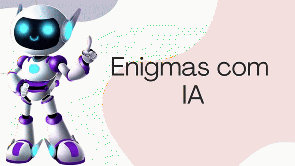
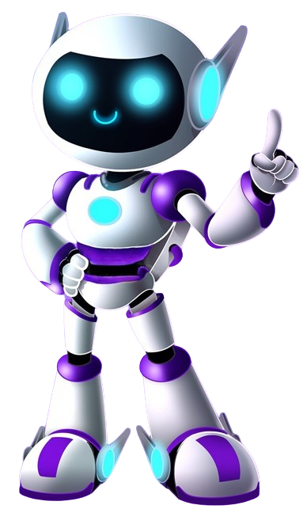

# Enigma com IA

# Sumário <br id="topo">
- [Objetivo](#objetivo)
- [Instalações](#instalações)
- [Demonstração](#demonstração)
- [Tecnologias](#tecnologias)


# 🎯 Objetivo <a name="objetivo"></a>
O objetivo do Enigma com IA é oferecer aos usuários uma experiência divertida e desafiadora, onde eles podem testar suas habilidades de resolução de problemas e raciocínio lógico. O chatbot gera variedades de enigmas intrigantes e estimulantes, proporcionando aos usuários a oportunidade de exercitar suas mentes enquanto se divertem.


# 🛠️ Instalações:
```sh
pip install streamlit -U
```
```sh
pip install -q -U google-generativeai
```
<br>

### Para rodar: 
```sh 
streamlit run main.py
```

# 🎥 Demonstração:


# 👩🏽‍💻 Tecnologias:
- Para o código:
- [](https://www.python.org/)

<br>

- Para a gravação:
- [](https://obsproject.com/pt-br/download)

<br>

 <a href="https://www.linkedin.com/in/sarah-santana-843394200/" target="_blank"></a>


